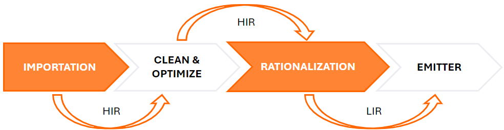

import Banner from './images/banner.jpg'
import Overview from './images/Overview.png';
import CompileCsharpCode from './images/CompileCsharpCode.png';
import CompileIlCode from './images/CompileIlCode.png';
import GiscusComponent from '@site/src/components/GiscusComponent';

<div style={{textAlign: 'center'}}>
    
</div>

## Introduction

The goal of this tutorial is to give you an overview of the **Dotnet Runtime** project. It is intended for developers at **all experience levels**.

We will explain the various steps that enable the transformation of C# code into native code, executable on any type of machine architecture, such as OSX, Unix-x64, etc. 

The transformation process is constructed as follows:

<div style={{textAlign: 'center'}}>
    
</div>

This process can be broken down into two distinct parts :
* The first part involves compiling the C# code into **intermediate code**. 
* The second part involves compiling this **intermediate code** into **native code** on-the-fly during program execution.

We will explain each part in the following chapters.

## Compile the C# code into intermediate code

<div style={{textAlign: 'center'}}>
    
</div>

Imagine you have the following C# file. The initial step is to convert the C# code into intermediate code. 
To achieve this, you must execute the `dotnet build` command.

```
Console.WriteLine("Hello world!");
Console.ReadLine();
```

This command is a part of the dotnet SDK project: [https://github.com/dotnet/sdk](https://github.com/dotnet/sdk), and it performs the following actions:

1. Resolves the path of the `MSBuild.dll` file, which must be present in the root directory of your DOTNET SDK.
2. Executes the command `MSBuild <projectName> -t:Rebuild -consoleloggerparameters:Summary`.
3. The MSBUILD project, whose source code is located at this address [https://github.com/dotnet/msbuild](https://github.com/dotnet/msbuild), uses the Roslyn library to compile the C# code into intermediate code (IL).

The compilation process consists of several steps:

1. **Tokenizer** : In the context of a compiler, tokenization (also known as lexing or lexical analysis) is the process of converting the source code into a sequence of strings with assigned meanings (tokens). The program that performs tokenization is called a tokenizer or lexer.
2. **Parser** :  In the parsing phase, output from the tokenization phase is used to build a data structure named an abstract syntax tree, giving a structural representation of the input while checking for correct syntax.
3. **Declaration** : Source and imported metadata are analyzed to form named symbols.
4. **Binding** : Match identifiers in the code to symbols.
5. **IL Emission** : Intermediate Language is emitted with all the information.

Now that the intermediate code has been generated, we can proceed with the program's execution.

## Compilation of the intermediate code on-the-fly

<div style={{textAlign: 'center'}}>
    
</div>

Execute the command `dotnet run` to launch the execution of your application.

### Virtual Machine

Upon its launch, the **Virtual Machine** must first be initialized, and it performs a sequence of actions:

1. Set up the infrastructure that needs to be in place before anything else can run.
2. Initialize the core, low-level components.
3. Start up the low-level components, i.e., error handling, profiling API, debugging.
4. Start the main components, i.e., Garbage Collector (GC), AppDomains, Security.
5. Finalize the setup and then notify other components that the Virtual Machine has started.

Once the Virtual Machine is initialized, it passes the intermediate code to the **Just-In-Time compiler**.
There are two contracts between the Just-In-Time compiler and the virtual machine, allowing for bilateral communication between these two components

The `ICorJitCompiler` interface ([https://github.com/dotnet/runtime/blob/4765dd1b9f1aa58f16d6922438bcc6cb01b4a666/src/coreclr/inc/corjit.h](https://github.com/dotnet/runtime/blob/4765dd1b9f1aa58f16d6922438bcc6cb01b4a666/src/coreclr/inc/corjit.h)) serves as the entry point for the Virtual Machine and includes several important methods, such as:

* **compileMethod**: The Virtual Machine passes an object `ICorJitInfo` that holds the IL code.

The `ICorJitInfo` interface ([https://github.com/dotnet/runtime/blob/b8e1296c832858e7f4b0eb2949afa73147a91981/src/coreclr/inc/corinfo.h](https://github.com/dotnet/runtime/blob/b8e1296c832858e7f4b0eb2949afa73147a91981/src/coreclr/inc/corinfo.h)) is an interface implemented by the Virtual Machine. It comprises a large number of methods and is used by the Just-In-Time compiler to look up metadata tokens, traverse type signatures, compute field and vtable offsets, and find method entry points.

In our case, the `compileMethod` method is crucial as it contains the logic to compile the intermediate code into native code.

### Just-In-Time compiler



Here are the most important steps:

1. **Importation** :  For each Statement instruction, we will create the HIR form. The HIR form of `int Foo(int x) => x * 2` is:

```
STMT 0
*         RETURN          INT
\--*      MUL             INT
   +--*   LCL_VAR         INT  arg0
   \--*   CNS_INT         INT  2
```

2. **Clean and optimize**

   2.1 **Morphing** : Including a certain number of transformations, for example, to improve performance. The operation `x * 2` can be replaced by a left bit shift operation. The HIR form then becomes :

   ```
   STMT 0
   *         RETURN          INT
   \--*      LSH             INT
      +--*   LCL_VAR         INT  arg0
      \--*   CNS_INT         INT  1
   ```

   2.2 **Inlining** : Determines whether a function call is likely to be a good candidate for inlining by estimating the size of the native code of the function. If the situation is advantageous, a `Compiler` object is created, and the nodes are copied into this object after the importation phase has been executed.
   
   2.3 **Optimize layout** : The goal here is to eliminate redundant Basic Blocks that will never be executed. For instance, in the following code, the instruction block `throw new Exception("Sid");` is disregarded because the condition is never fulfilled.

   ```
   if ('B' == 'C')
       throw new Exception("Sid");
   ```

   2.4 **Building SSA form** : The goal here is to remove unnecessary variables.

3. **Rationalization** : Eliminating the parental context in trees results in a transition from a hierarchical model (HIR) to a linear model (LIR).
4. **Emitter** : For each block, we generate the function `prologue`, `body`, and `epilogue`, and then emit the result into memory. The code is located in the `emitarm.cpp` class ([https://github.com/dotnet/runtime/blob/b8e1296c832858e7f4b0eb2949afa73147a91981/src/coreclr/jit/emitarm.cpp](https://github.com/dotnet/runtime/blob/b8e1296c832858e7f4b0eb2949afa73147a91981/src/coreclr/jit/emitarm.cpp)).

Now that the native code has been emitted, the `compileMethod` function returns a pointer to it, which can then be executed by the virtual machine.

## Conclusion

Now that you have a comprehensive understanding of the various components involved in just-in-time compilation, we will describe in the upcoming articles different sections of the DOTNET RUNTIME library that seem interesting to me. 
Feel free to leave a comment if you have any remarks 😀

## Resources

| Link |
| ---- |
| https://github.com/dotnet/roslyn/blob/main/docs/wiki/Roslyn-Overview.md, .NET Compiler Platform ("Roslyn") Overview |
| https://github.com/dotnet/coreclr/blob/master/Documentation/botr/ryujit-overview.md#pre-import, JIT Compiler Structure |
| https://mattwarren.org/2017/03/23/Hitchhikers-Guide-to-the-CoreCLR-Source-Code/, A Hitchhikers Guide to the CoreCLR Source Code |
| https://mattwarren.org/2017/02/07/The-68-things-the-CLR-does-before-executing-a-single-line-of-your-code/, The 68 things the CLR does before executing a single line of your code |
| https://mattwarren.org/2018/07/05/.NET-JIT-and-CLR-Joined-at-the-Hip/, .NET JIT and CLR - Joined at the Hip |
| https://community.arm.com/arm-community-blogs/b/architectures-and-processors-blog/posts/if-conversion-within-dotnet-part-1, If Conversion Within .NET - Part 1 |
| https://medium.com/@sruthk/cracking-assembly-function-prolog-and-epilog-in-x86-cb3c3461bcd3, Cracking Assembly — Function Prolog and Epilog in x86 |

<GiscusComponent />