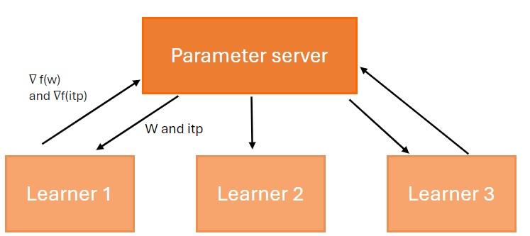
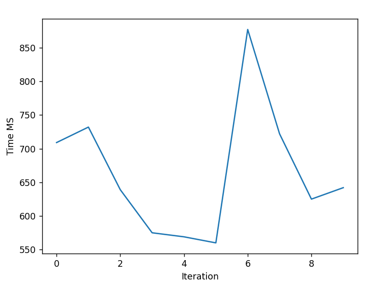
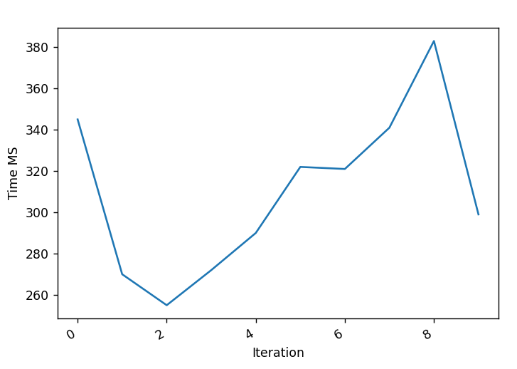
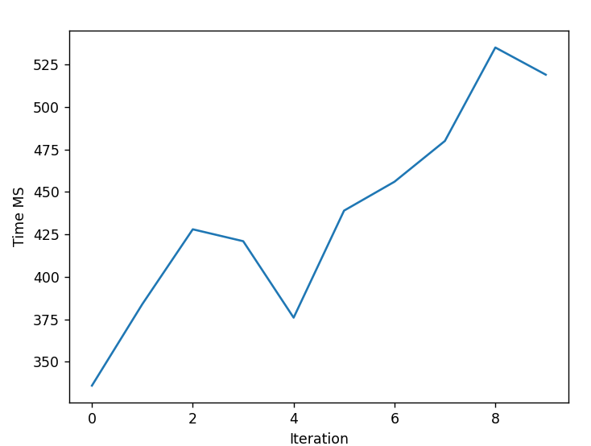
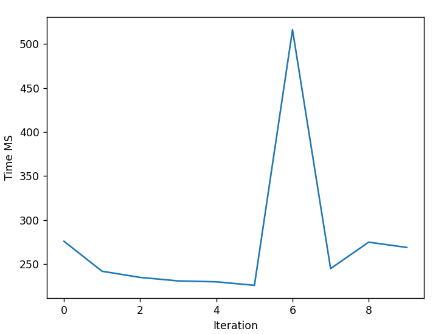

import Banner from './images/banner.png'
import GiscusComponent from '@site/src/components/GiscusComponent';

<div style={{textAlign: 'center'}}>
    
</div>

## Introduction

The naive implementation of the SGD algorithm presented in the [first part](../stochastic-gradient-from-scratch) is not efficient and can be improved by addressing several points.

* The paper [Parallelized Stochastic Gradient Descent](https://papers.nips.cc/paper_files/paper/2010/file/abea47ba24142ed16b7d8fbf2c740e0d-Paper.pdf) suggests executing the algorithm on multiple machines in parallel.

* Utilizing the GPU for matrix computations.

## Supporting Parallelism

The main idea is to divide the dataset into subsets/mini-batches and distribute them across multiple machines (learners/processing units).

This method was initially proposed by [Google's DistBelief](https://research.google/pubs/large-scale-distributed-deep-networks/). 
It uses a central parameter server (PS) that updates the learning model with gradients calculated by the learning nodes.



There are two modes for updating the learning model:

1. **Synchrone** : The parameter server waits to receive gradients from all learning nodes before updating the model parameters. This approach takes longer and is riskier, as it requires the completion of execution of a portion or all of the nodes.

2. **Asynchrone** : The parameter server does not wait for the learning nodes. There is a risk that learning nodes execute the algorithm on an outdated version of the model.

The synchronous configuration consists of three methods:

**Full Sync SGD** : The parameter server (PS) waits to receive the gradient calculation from all learning nodes.

**K-Sync SGD** : The parameter server (PS) waits to receive K gradient calculation results, where each result comes from a different node. When received, all ongoing calculations on the nodes are canceled. Here, for each iteration, a mini-batch is distributed to each learning node.

**K-batch-sync SGD** : The parameter server (PS) waits to receive K gradient calculation results, where one or more results can come from the same node.

The asynchronous configuration consists of three methods:

**Async SGD** : As soon as the parameter server (PS) receives the gradient calculation from a learning node, it updates the learning model.

**K-async SGD** : The parameter server (PS) waits to receive K gradient calculation results, where each result comes from a different node. Here, for each iteration, a mini-batch is distributed to each learning node.

**K-batch async SGD** : The parameter server (PS) waits to receive K gradient calculation results, where one or more results can come from the same node.

Unlinke the `synchronous` mode, the `asynchronous` mode accepts all results from learning nodes and does not cancel ongoing executions.

At each iteration, if more than one gradient has been received by the PS server, we calculate the average and use this value to update the learning model parameters. Here is the formula for updating the parameter:

$$
w_{j+1} = w_{j} - \frac{\eta}{K} * \sum_{l=1}^{K} g(w_{\tau(l,j)},\xi_{l,j})
$$

* $l$ :  denotes the index of the K learners that contribute to the update at the corresponding iteration.
* $\tau_{l,j}$: is one mini-batch of m samples used by the l-th learner at the j-th iteration.
* $\xi_{l,j}$: denotes the iteration index when the l-th learner last read from the central PS.
* $g(w_{\tau(l,j)},\xi_{l,j}) = \frac{1}{n} * \sum_{}^{} \nabla f(w_{\tau(l,j)},\varepsilon_{l,j})$ : average gradient of the loss function evaluated over the mini-batch $\tau_{l,j}$.


Here is the `K-batch async SGD` algorithm.

Algorithm for the PS server to update the parameters `w` and `itp` of a complex-shaped linear function.

```
1. Define the number of learning nodes `N`.
2. Define the number of mini-batch `K` required to update the model parameters.
3. Define the number of iterations  `epoch`.
4. Define the learning rate `η`. This determines the step size at each iteration while moving toward a minimum of a loss function.
5. Initialize the vector `w` for `weight`.
6. Initialize the variable `itp` for `intercept`.
7. for i = 1 .... epoch

   7.1 for n .... N do in parallel
   
    7.1.1 Randomly shuffle samples in the training set and store the result in the `tx` and `ty` variables.

    7.1.2 Send the variables `tx`, `ty`, `w` and `itp` to node `k`

   7.2 Wait to receive `K` mini-batches and store the results in two variables `nwi` and `nitpi` .

   7.3 $w_{j+1} = w_{j} - \frac{\eta}{K} \sum_{l=1}^{K} (nwi)$

   7.4 $itp = itp - \eta * \sum_{\eta}^{K}(nitpi)$
```

Algorithm for a learning node to calculate the gradient of a complex-shaped linear function.

```
1. Receive the mini-batch `tx` and `ty`.
2. Receive the parameter `w`.
3. Receive the parameter `itp`.
4. Calculate the number of observations `N`.
5. Calculate the gradient $g = \frac{1}{N} \sum_{i}^{N} -2 * wT * tx * (ty - (itp + w*tx))$
6. Calculate the intercept $itp = \frac{1}{N} * \sum_{i}^{N} -2 * itp * (ty - (itp + w*tx))$
7. Send the variables `g` and `itp` to the PS server.
```

## GPU

As you may have noticed in the previous chapter, both the parameter server and learning nodes perform computations on matrices.

It is recommended to carry out such calculations on the GPU, especially when dealing with large matrices.

If you are not familiar with the key concepts of a GPU, I encourage you to read the next chapter; otherwise, proceed to the [CUDA](#cuda) chapter.

### CUDA

In this article, we use CUDA C++, an extension of C++ that enables developers to define `kernels`, which, when invoked, are executed N times in parallel by N different CUDA threads.

The thread identifier is calculated as follows: `idx = threadIdx.x + blockIdx.x * blockDim.x`. The parameters for this formula are as follows:

* `BlockDim` : Dimension of a block, corresponding to the number of threads.
* `BlockIdx` :  Index of the block in a grid.
* `ThreadIdx` : Index of the thread in a block.

CUDA introduces the following entities:
* `Thread` : An abstract entity representing the execution of the `kernel`.
* `Block` : Composed of multiple  `wraps`, and each `wrap` has 32 threads.
* `Grid` : Blocks are combined to form a grid.

During their execution, CUDA threads have access to different memory spaces, including but not limited to:
* `Register` : Each thread has its own private memory.
* `Shared memory` : Each `Block` has memory shared among all its threads. This memory has the same lifespan as the block.
* `Global GPU memory` : All threads have access to global memory.

If you want more information on the subject, I recommend reading the excellent programming guide [https://docs.nvidia.com/cuda/cuda-c-programming-guide/index.html#programming-model](https://docs.nvidia.com/cuda/cuda-c-programming-guide/index.html#programming-model).

Now that you have an overview of all the involved entities when developing with CUDA, you can write the algorithm for calculating the gradient of a function on the GPU, considering the following points:

* If the matrix is too large, it can be divided into several tiles. The [CUDA documentation](https://docs.nvidia.com/cuda/cublas/index.html#tiling-design-approach)  explains how this works.
* Reduce the number of interactions between a thread and the Global GPU Memory; the thread should, whenever possible, use shared memory.

You are now ready to write your first matrix calculation algorithm on a GPU.

### Performing Matrix Operations

The matrix operation most commonly used in the SGD algorithm is the multiplication of a matrix with a vector.

This article on [GPU matrix-vector product (gemv)](https://www.bealto.com/gpu-gemv_intro.html) explains clearly the various ways to implement this algorithm.

In our case, we will not implement the algorithm from scratch or others. Instead, we will use the BLAS library provided by CUDA, which is optimized for performing this type of calculation.

It offers several useful functions for writing an optimized version of the SGD algorithm:

| Fonction | Description | URL | 
| -------- | ----------- | --- |
| gemv     | Multiply a matrix by a vector | [https://docs.nvidia.com/cuda/cublas/index.html#cublas-t-gemv](https://docs.nvidia.com/cuda/cublas/index.html#cublas-t-gemv) |
| scal     | Multiply a vector by a variable | [https://docs.nvidia.com/cuda/cublas/index.html#cublas-t-scal](https://docs.nvidia.com/cuda/cublas/index.html#cublas-t-scal) |
| axpy     | Multiply a vector `x` by `alpha`  and add the result to vector `y` | [https://docs.nvidia.com/cuda/cublas/index.html#cublas-t-axpy](https://docs.nvidia.com/cuda/cublas/index.html#cublas-t-axpy) |

We used the [ILGPU](https://github.com/m4rs-mt/ILGPU/tree/master) library to write our algorithm; you can find the source code here [https://github.com/simpleidserver/DiveIt/Projects/SGDOptimization/GPUMathUtils.cs](https://github.com/simpleidserver/DiveIt/Projects/SGDOptimization/GPUMathUtils.cs).

## Performance

We conducted several tests to compare performance.

All tests were run on the same dataset.

| Paramètre | Valeur |
| --------- | ------ |
| Number of test data | 1500 |
| Nubmer of parameters | 15000 |
| Number of iterations (epoch) | 10 |
| Number of machines (k) | 2 |

**Sequential SGD - CPU (6837 MS)**



**Sequential SGD - GPU (3243 MS)**



**Parallel SGD  - CPU (4602 MS)**



**Parallel SGD - GPU (2911 MS)**



As you can see, the performance is much better when the GPU is used to compute matrices. 
Even though the project does not distribute the computational load of the function gradient across multiple nodes but across multiple threads, the performance remains entirely acceptable.

## Conclusion

The proposed algorithm is not ready for use in a .NET library for production. However, understanding it can help you choose a library for machine learning.

To choose a library, you should check if it supports the following points. They are crucial as they will help reduce the training time of an ML model.

* Capable of supporting parallelism.
* Capable of supporting execution on one or multiple GPUs.

The source code of the project can be found here [https://github.com/simpleidserver/DiveIt/Projects/SGDOptimization](https://github.com/simpleidserver/DiveIt/Projects/SGDOptimization).

## Ressources

https://eurocc.cyi.ac.cy/wp-content/uploads/2ndIntermediate-GPUCUDA.pdf, GPU programming using CUDA

https://wlandau.github.io/gpu/lectures/cublas-cula/cublas-cula.pdf, The CUBLAS and CULA librarie

https://www.bealto.com/gpu-gemv_v2.html, GPU matrix-vector product

https://github.com/ecrc/kblas-gpu/blob/8af76dc862c74cbe880569ff2ccf6e5e54245430/src/blas_l2/sgemv.cu, KBLAS is a high performance CUDA library for subset of BLAS and LAPACK routines optimized for NVIDIA GPUs.

https://docs.nvidia.com/cuda/cublas/index.html, CUDA.

<GiscusComponent />