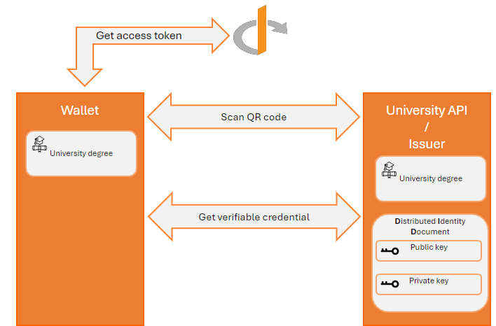
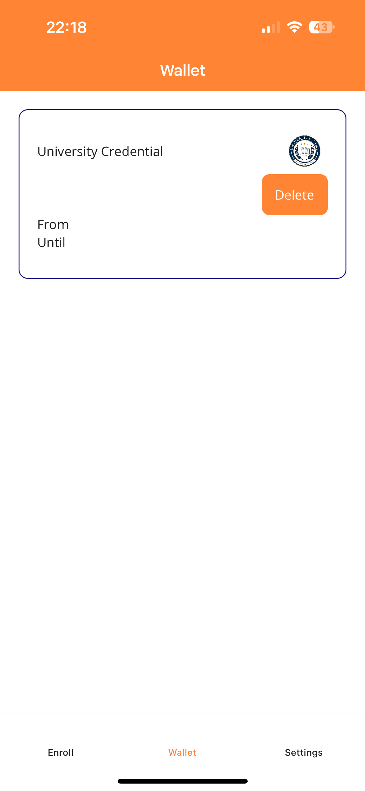

# Part 1 - Generate verifiable credentials with pre-authorized code grant-type

Depuis quelques temps, la commission européenne travaille sur un projet de portefeuille électronique qui sera disponible à tous les citoyens européens, ce projet se nomme [ebsi](https://ec.europa.eu/digital-building-blocks/sites/display/EBSI/EBSI+Verifiable+Credentials).
L'idée, est d'offrir aux institutions publiques la possibilité de distribuer des certificats aux citoyens qui seront stockés uniquement sur leurs appareils mobiles comme : Certificat COVID, la carte d'identité, le permis de conduire, les prescriptions médicales etc...

Ce projet ambitieux a des avantages :

* Seul le citoyen européen possédera ses données.
* Supprimer la centralisation des données.
* Plus sécurisée, car la technologie de blockchain est utilisée pour stocker la clef publique de chaque citoyen.

Dans cette article, nous allons expliquer comment vous pouvez créer une API REST pour une université lambda.
Elle doit être capable de produire des certificats, prouvant la possession d'un diplôme universitaire.

Ces preuves pourront par la suite être téléchargées sur une application mobile.

## Architecture

Les Verifiable Credentials peuvent être récupérés de deux façons :
* **OAUTH 2.0 Authorization code flow** : le portefeuille électronique a besoin du consentement de l'utilisateur pour récupérer les Verifiable Credentials. Ce workflow implique une intéraction supplémentaire de la part de l'utilisateur final, ce qui n'est pas forcément souhaitable. Cependant ce flux est supporté par toutes les solutions d'identity providers OPENID telle que Keycloak.
* **Pre authorized code flow** : Le RFC [OpenID for Verifiable Credential Issuance](https://openid.net/specs/openid-4-verifiable-credential-issuance-1_0.html), propose un nouveau grant-type `urn:ietf:params:oauth:grant-type:pre-authorized_code`. Il permet au portefeuille électronique de récupérer les `Verifiable Credentials` sans avoir besoin du consentement de l'utilisateur, par conséquent il n'est pas nécessaire d'intéragir avec le navigateur internet. Ce grant-type est assez récent, et il y a des chances qu'il ne soit pas supporté par tous les identity providers.

Dans ce tutorial, nous allons utiliser le grant-type `urn:ietf:params:oauth:grant-type:pre-authorized_code`.

Ci-dessous, vous trouverez le diagramme avec les intéractions entre les composants principaux.

Même si il n'est pas explicitement expliqué dans le [RFC](https://openid.net/specs/openid-4-verifiable-credential-issuance-1_0.html) que le credential issuer et l'identity provider sont deux entités distinctes, nous avons fait le choix de faire une distinction pour les raisons suivantes :

* Eviter d'avoir une application monolithe, qui agirait comme un serveur d'identité, mais aussi une API REST, capable de produire des `Verifiable Credentials`.
* Le credential issuer derait être capable de supporter un ou plusieurs serveurs d'authorisation.



Le flux `pre authorized code` est composé des étapes suivantes : 
1. **Scan QR code** : L'étudiant navigue sur le site de son université. Il clique le bouton pour partager son diplôme. Cette action génère un QR code, qui peut être scanné par le portefeuille électronique (par exemple : une application mobile).
2. **Get access token** : Le QR code possède un `pre-authorized_code`, il est utilisé par le wallet pour récupérer un access token. Etant donné que l'identity provider et le credential issuer, sont deux applications distinctes, le [RFC](https://openid.net/specs/openid-4-verifiable-credential-issuance-1_0.html) ne décrit pas le protocole d'échange pour que les deux applications aient le même `pre-authorized code`.
3. **Get verifiable credential** : Le portefeuille électronique utilise l'access token pour récupérer le `verifiable credential`. 

Pour produire le `verifiable credential`, l'API REST utilise son identité décentralisée.
La clef publique est stockée dans le document DID, mais la clef privée est possédée uniquement par l'API.

Pour plus d'informations sur le sujet, je vous invite à lire cet [article](https://www.identity.com/what-are-decentralized-identifiers-dids/).

Maintenant que vous avez une vue d'ensemble sur l'architecture à mettre en place, nous allons implémenter la solution.

Nous utiliserons le DOTNET TEMPLATE du projet [SimpleIdServer](https://simpleidserver.com/docs/installation/dotnettemplate) pour créer et configurer notre Credential Issuer ainsi que son serveur d'identité, qui supporte le grant-type `urn:ietf:params:oauth:grant-type:pre-authorized_code`.

## Créer et configure l'identity provider

Ouvrez une application console, et installez les templates de projet .NET de [SimpleIdServer](https://github.com/simpleidserver/SimpleIdServer) 

```
dotnet new --install SimpleIdServer.Templates
```

To create a web project named `IdServer` with the `SimpleIdServer.IdServer` package installed, execute the command line :

```
dotnet new idserver -n IdServer 
```

## Créer et configurer l'API REST


To create a web project named CredentialIssuer with the `SimpleIdServer.CredentialIssuer` package installed, execute the command line :

```
dotnet new credissuer -n CredentialIssuer
```

L'API est maintenant prête à être configurée, mais avant toute chose, la définition du credential doit être configurée.

## Configurer la définition du credential et les claims de l'étudiant

Chaque type de credential possède une définition qui est exposée par le endpoint ".well-known/openid-credential-issuer" du credential issuer.
Elle contient les propriétés suivantes :

* **Format** : Identifiant du format, par exemple `ldp_vc`, `mso_mdoc` ou `jwt_vc_json`. Vous trouverez plus d'informations sur ces formats dans l'[appendix A 1 du RFC](https://openid.net/specs/openid-4-verifiable-credential-issuance-1_0.html#appendix-A.1).
* **Scope** : Scope OAUTH2.0 utilisé durant le [authorization code flow](https://openid.net/specs/openid-4-verifiable-credential-issuance-1_0.html#section-3.4).
* **Cryptographic binding methods supported** : liste des algorithmes pouvant être utilisés par l'issuer, pour créer la preuve de possession du credential par exemple `did:key` ou `did:ethr`, et ainsi transformer un `credential` en `verifiable credential`.
* **Credential signing algorithm values supported** : liste des algorithmes utilisés par l'issuer pour signer les verifiable credentials.
* **Display** : Les propriétés utilisées par le portefeuille électronique, pour afficher les credentials par exemple les traductions ou la couleur du texte.

Par défault, le projet contient un fichier `CredentialIssuerConfiguration` avec la définition du credential ainsi que les claims de l'étudiant.

Dans le cadre de l'article, il n'est pas nécessaire de modifier le fichier, car il possède déjà la définition du credential `University Degree`, les règles de mapping pour alimenter le credential à partir des claims, ainsi que de quelques claims.

L'algorithme [did:key](https://w3c-ccg.github.io/did-method-key/) est configuré par défault, il est utilisé pour transformer les credential en verifiable credential.
Cet algorithme n'est pas adapté pour un usage en production, car le document d'identité numérique n'est pas stocké dans un endroit centralisé, comme par exemple le block-chain.

L'algorithme did-ethr est plus adapté pour un usage en production, car le document DID est déployé dans un smart contrat sur ethereum.
Vous trouverez plus d'informations [ici](https://github.com/uport-project/ethr-did/blob/master/docs/index.md).

## Portefeuille électronique

Nous utilisons [l'application mobile de SimpleIdServer](https://install.appcenter.ms/users/agentsimpleidserver-gmail.com/apps/simpleidserver/distribution_groups/public), comme portefeuille électronique. 

Téléchargez la sur votre smartphone, puis naviguez sur le site web du credential issuer.
Authentifiez vous avez les credentials suivant et cliquez sur l'onget Credentials.

| Parameter | Value         |
| --------- | ------------- |
| Login     | administrator |
| Password  | password      |

La page affiche les types de credentials pouvant être partagés.


Cliquez sur le bouton `Share` et scannez avec l'application mobile le QR code. Après quelques secondes, le message `The verifiable credential has been enrolled` devrait s'afficher.
Cliquez sur l'onglet `Wallet` pour afficher le nouveau Verifiable Credential.



Bravo ! Vous avez maintenant votre premier credential dans votre portefeuille électronique !

## Conclusion

Au travers l'article, nous avons vu comment le nouveau grant-type `pre-authorized code` qui a été introduit avec le [RFC](https://openid.net/specs/openid-4-verifiable-credential-issuance-1_0.html), peut être utilisé pour récupérer un Verifiable Credential auprès d'une API REST.

Dans un prochain article, nous expliquerons comment le portefeuille électronique peut être utilisé pour créer un compte local sur un site internet.

## Resources

https://openid.net/specs/openid-4-verifiable-credential-issuance-1_0.html

https://www.w3.org/TR/vc-data-model/, Verifiable Credentials Data Model v1.1

https://www.identity.com/what-are-decentralized-identifiers-dids/, What Are Decentralized Identifiers (DIDs) ?

https://w3c-ccg.github.io/did-method-key/, The did:key Method v0.7

https://github.com/uport-project/ethr-did/blob/master/docs/index.md, Ethr-DID