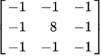

# Implement Convolutional Neural Network from scratch

import Architecture from './images/architecture.png'
import BackPropagation from './images/backpropagation.png'
import CnnArchitecture from './images/cnn-architecture.png'
import NeuronConvolutional from './images/neuron-conv.png'
import Banner from './images/banner.png'

    

## Introduction

In this article, we will cover various theoretical topics with the aim of implementing a neural network in C# that is capable of recognizing a digit present in an image.

The article is divided into three parts:

1. Presenting the key principles of a neural network.
2. Explaining the architecture of a Convolutional Neural Network.
3. C# source code.

If you are familiar with the concept of neural networks, feel free to skip this chapter and proceed to the next.

## Neural Network Architecture

A neural network is composed of multiple interconnected layers, with neurons forming connections between them.

There are three types of layers.

    

### 1. Input Layer

The input layer consists of neurons representing the features of the input data. Each neuron corresponds to a feature, and its value represents the value of that feature.

### 2. Hidden Layer

Between the input layer and the output layer, there can be multiple hidden layers.

Generally, each neuron in a hidden layer is connected to all neurons in the preceding layer, a configuration known as a `fully connected` or `dense layer` type.

A hidden layer has two parameters:

* **weights** : Each connection between two neurons has a `weight`, which is a parameter that influences the amount of information transmitted between them.

* **bias** : Constant assigned to a layer.

These two parameters are part of the calculation formula for the `WeightedSum` :

$$
SumWeighted = bias + \sum_{i=1}^{n}xi *weighti
$$

These two parameters are adjusted during the learning process, specifically during the `back propagation` step.

An activation function can then be applied to the calculated parameter $$SumWeighted$$.
Generally, the same type of function is chosen for all hidden layers.
The choice depends on the nature of the neural network; for example, a CNN or MLP network typically uses ReLU.

There are several types of functions, listed as follows.

$$
output = f(SumWeighted)
$$

| Activation                         | Network type |
| ---------------------------------- | ------------ |
| Rectified Linear Activation (ReLU) | MLP,CNN      |
| Logistic (Sigmoid)                 | RNN          |
| Hyperbolic Tangent (Tanh)          | RNN          |

:::danger

There are layers where the parameters `weights`, `bias` and the activation function are not used.

:::

### 3. Output Layer

The final layer of the neural network is the output layer.
It shares the same structure as a hidden layer as it comprises multiple neurons and may have the parameters `weights` and `bias`.

This layer receives information from the last hidden layer and conducts computations to predict or classify the received data.

Depending on the nature of the problem the neural network aims to solve, you can select one of these layers:

| Problem                                 | Alg                 |
| --------------------------------------- | ------------------- |
| Classification of more than two classes | Softmax             |
| Binary classification                   | Sigmoid             |
| Regression                              | Linear regression   |

### Neural network training algorithm

Now that you have an overview of the components that constitute a neural network.

We will explain the various steps to train a neural network, outlined as follows:

1. Initialize the parameters of all layers : `weights` ou `bias`.
2. Execute the following steps `N` times.
2.1 For each layer, execute the `forward propagation` step.
2.2 Calculate the error.
2.3 For each layer, execute the `backward propagation` step.

#### 1. Initialisation des paramètres

The learning parameters of the layers, such as `weights` and `bias`, must be initialized with random values.

According to the [Xavier Initialization](https://cs230.stanford.edu/section/4/) method, this step is more crucial than one might think because if the initial values are too large or too small, then the training of the neural network becomes inefficient.

Depending on the nature of the layer, it may not be necessary to initialize these parameters.

#### 2. Forward propagation

The `Forward propagation` step is executed when a layer receives data from another. It consists of the following steps:

1. For each neuron, calculate the `sum weighted` : $sm = \sum_{i=1}^{n}xi *wi$.

   1.1. $wi$ is the value of the weight that the neuron has with the i-th neuron.

   1.2. $xi$ is the value of the i-th neuron.

2. Add the `sum-weighted` to the  `bias` parameter :  $t = b + \sum_{i=1}^{n}xi *wi$.

3. Call the activation function:  $f(b + \sum_{i=1}^{n}xi *wi)$.

#### 3. Calculate the error.

When data is received from the last layer, the result can be compared with the expected outcome. 
The difference indicates the error that the network made during its prediction.

There are various methods to calculate the error; once again, the choice depends on the nature of the problem.

| Problem                                 | Loss function                  |
| --------------------------------------- | ------------------------------ |
| Classification of more than two classes | Cross Entropy Loss             |
| Binary classification                   | Logistic loss                  |

#### 4. Backpropagation

The error calculated by the loss function is then propagated through the various layers.

The learning process begins with `Backpropagation` aiming to reduce the cost of the loss function by adjusting the parameters `weights` and `bias` of the different layers.

The degree of adjustment of the variables `weights` and `bias` is calculated by gradients.
They help understand how a variable like the `weight` can influence the total result `Loss`.

$$
\frac{\delta Loss}{\delta weight} , \frac{\delta Loss}{\delta bias}
$$

    

## Convolutional Neural Network (CNN)

The neural network tailored for image recognition is of the Convolutional type.

The typical architecture of a CNN consists of four layers."

* Input layer : Extract the data from an image in one of the two formats:

  * Three two-dimensional RGB matrices.

  * A two-dimensional matrix with grayscale values.

* First hidden layer : Convolutional layer.

* Second hidden layer : Max pooling layer.

* Output layer : softmax layer.

    

| Parameter | Value |
| --------- | ----- |
| Number of filters | 3 |
| Kernel size | 3 |
| Pool size | 2 |
| Number of classes | 3 |

### 1. Convolutional Layer

Before describing the structure of this layer, it is important to understand the concept of a convolution matrix.

A convolution matrix, also known as a kernel, is a two-dimensional matrix. 
When applied to an image, it enables various effects, as demonstrated in the example below.
 For a comprehensive list of filters, please refer to the [Wikipedia](https://en.wikipedia.org/wiki/Kernel_(image_processing)) website.

| Operation              | Kernel             | Result                                       |
| ---------------------- | ------------------ | -------------------------------------------- |
| Edge detection |        |  |

Assuming the image has been extracted into a grayscale matrix of size $$(imw * imh)$$, the convolution algorithm consists of the following steps:

1. Create a convolution matrix/kernel of size $$(kw * kh)$$. By default, the matrix will have a size of 3x3.

2. Create an output matrix of size $$(imw - kw + 1) * (imh - kh + 1)$$.

3. Retrieve all windows from the input image. The center of the kernel matrix is used as a pointer, and the algorithm moves the pointer over each column and each row of the image. The area covered by the kernel, also called a window, is then stored in a list called windows.

4. For each element in the windows list:

   4.1. Multiply the value by the kernel.

   4.2. Calculate the average and store the result in the output matrix.

To summarize, here is the mathematical equation to calculate each element of the output matrix.

$$
V=  \frac{\sum_{m}^{imgsize}\sum_{k}^{ksize}kernel(kx;ky) * img(mx,my)}{F}
$$

* $$kernel(kx;ky)$$ : the coefficient of the convolution kernel at position kx,ky.
* $$img(mx,my)$$ : the data of the pixel that corresponds to img(mx,my).
* $$F$$ : Sum of the coefficients of the kernel.

By applying this algorithm multiple times, there is a risk of losing pixels on the edges of the image. To address this issue, the `padding` parameter has been introduced.

#### Padding parameter

This parameter indicates the number of pixels to be added to the edges of the image.

Assuming that the padding parameter is defined by the variable `p`, the size of the output matrix will be calculated as follows:

$$
(imw - kw + pw + 1) * (imh - kh + ph + 1)
$$

In many cases, the padding value is set to $$(kw-1,kh-1)$$ so that the output image has the same size as the input image.

#### Stride parameter

For each pixel of the image, a convolution window is applied. This operation can be resource-intensive, especially when the algorithm is applied to a large image.

To decrease the number of iterations, the `stride` parameter has been introduced. 
It defines the number of elements to be skipped in the width and height of the image. By default, this parameter is set to  `(1,1)`.

Assuming that the stride parameter is defined by the variable `s`, the size of the output matrix will be calculated as follows:

$$
((imw - kw + pw + sw) / sw) * ((imh - kh + ph + sh) / sh)
$$

#### Forward propagation

A convolutional layer consists of 1 or more neurons, and each neuron has its own convolution window.

During the `forward propagation` phase, each neuron executes the convolution algorithm on a window of the image.

Here are the main steps of the forward propagation algorithm:

1. Retrieve all windows of the input image.

2. For each input window, execute the convolution algorithm of each neuron and store the result in a list.

3. Store the list in the output matrix.

Here is the architecture of a neuron in a convolutional layer.

    

#### Backward propagation

Given that in the article, the convolutional layer does not have bias parameters and activation functions, the `backward propagation` algorithm amounts to computing this formula :

$$
\frac{\delta Loss}{\delta filter(x,y))} = \sum_{i}^{}\sum_{j}^{}\frac{\delta Loss}{\delta conv(i,j)}\frac{\delta conv(i,j)}{\delta filter(x,y)}
$$

### 2. Max Pooling layer

This layer consists of no neurons and does not have any `bias` or `weights` parameters. 
It reduces the size of the input matrix by applying the max operation to each window of the input matrix.

Its objective is twofold:

1. Reduce dimensionality.
2. For each region, find the maximum.

#### Forward propagation

The forward propagation algorithm consists of the following steps:

1. Define the size of the pooling window $$(pw * ph)$$.

2. Create an output matrix of size $$(iw / pw) * (ih / ph)$$.

3. Divide the input matrix into several windows of size  $$(pw * ph)$$.

4. For each window of the matrix, find the maximum value and assign this value to the cell of the output matrix.

#### Backward propagation

Given that the Pooling layer has no learning parameters, weights, or bias.

The backward propagation algorithm simply reconstructs a matrix of the same size as the last matrix received by the layer. 
Here are the main steps of the algorithm:

1. Create an output matrix of the same size as the input matrix.

2. Divide the matrix into several windows of size $$(pw * ph)$$.

3. For each cell of each window, if the element is not the maximum, set it to 0; otherwise, take the gradient of the error.

### 3. Softmax layer

The activation dense layer `softmax` consists of one or more neurons and has the learning parameters `weights` and `bias`.
The number of neurons is equal to the number of classes to predict.

The softmax function is used to calculate the probabilities of belonging to each class.

Here is the architecture of a softmax neuron.

#### Forward propagation

The forward propagation algorithm consists of the following steps:

1. Define the number of classes in a variable `n`.

2. For each class, create a neuron and initialize its `weight` parameter.

3. Initialize the layer's `bias` parameter.

4. For each neuron, multiply the input matrix by its weight and store the result in a variable $$Weights = \sum_{i=1}^{n}xi *weighti$$.

5. Calculate the sum with the bias and store the result in a variable $$SumWeighted = bias + Weights$$.

6. Finally, execute the activation function on each class $$softmax(ci) = \frac{exp(ci)}{\sum_{i}^{n}exp(i)}$$.

#### Backward propagation

The softmax layer has two learning parameters that need to be updated, and a variable `learningRate` which weighs the importance of the partial derivatives to update these parameters.

The algorithm must be able to compute the partial derivatives for these two parameters.

$$
\frac{\delta Loss}{\delta weight} = \frac{\delta Loss}{\delta out} * \frac{\delta out}{\delta net} * \frac{\delta net}{\delta weight}
$$

$$
\frac{\delta Loss}{\delta bias} = \frac{\delta Loss}{\delta out} * \frac{\delta out}{\delta bias}
$$

The derivative $$\frac{\delta Loss}{\delta out}$$ is quite simple to calculate.

If the predicted class is different from the expected one:

$$
\frac{\delta Loss}{\delta out(i)}=0
$$

If the predicted class is the same as the expected one: 

$$
\frac{\delta Loss}{\delta out(i)}=\frac{-1}{pi}
$$

The derivative $$\frac{\delta net}{\delta weight}$$ is equals to :

$$
net = bias + \sum_{i=1}^{n}x(i)*weight(i)

net = input
$$

The derivative $$\frac{\delta out}{\delta bias}$$ is equals to 1.

The last derivative, $$\frac{\delta out}{\delta net}$$, is more complex to calculate.
If you desire a complete demonstration, I invite you to read the article published on [medium](https://medium.com/@shine160700/softmax-function-and-the-maths-behind-it-12422d07c78a).

Once all these partial derivatives are calculated, the parameters can be updated as follows:

$$
weight = weight - learningRate * \frac{\delta Loss}{\delta weight}
$$

$$
bias = bias - learningRate * \frac{\delta Loss}{\delta bias}
$$

## C# implementation

The source code of the C# project can be found [here](https://github.com/simpleidserver/DiveIt/tree/main/Projects/CNN).

The project uses a MINST dataset from the [kaggle](https://www.kaggle.com/datasets/oddrationale/mnist-in-csv) website to train the Convolutional Neural Network.

After 3 iterations performed on a dataset of 5000 entries, the achieved performance is quite satisfactory. 

The accuracy is approximately 85%!

## Conclusion

Congratulations! You've reached the end of this article. :wink:

The C# implementation is not optimal and can still be improved.

For production use, I recommend using the excellent library [keras](https://keras.io/).

## Resources

* https://observablehq.com/@lemonnish/cross-correlation-of-2-matrices, Cross-correlation of 2 matrices

* https://www.ibm.com/topics/convolutional-neural-networks, What are convolutional neural networks?

*  https://developer.nvidia.com/discover/convolution#:~:text=The%20convolution%20algorithm%20is%20often,convolution%20operation%20is%20called%20deconvolution., Convolution

* https://web.pdx.edu/~jduh/courses/Archive/geog481w07/Students/Ludwig_ImageConvolution.pdf, Image Convolution

* https://d2l.ai/chapter_convolutional-neural-networks/conv-layer.html#fig-correlation, Convolutions for image

* https://towardsdatascience.com/a-comprehensive-guide-to-convolutional-neural-networks-the-eli5-way-3bd2b1164a53, A Comprehensive Guide to Convolutional Neural Networks — the ELI5 way

* https://victorzhou.com/blog/softmax/, Softmax

* https://www.sciencedirect.com/topics/computer-science/convolutional-layer, Convolutional Layer

* https://medium.com/@nerdjock/deep-learning-course-lesson-5-forward-and-backward-propagation-ec8e4e6a8b92, Forward and Backward Propagation