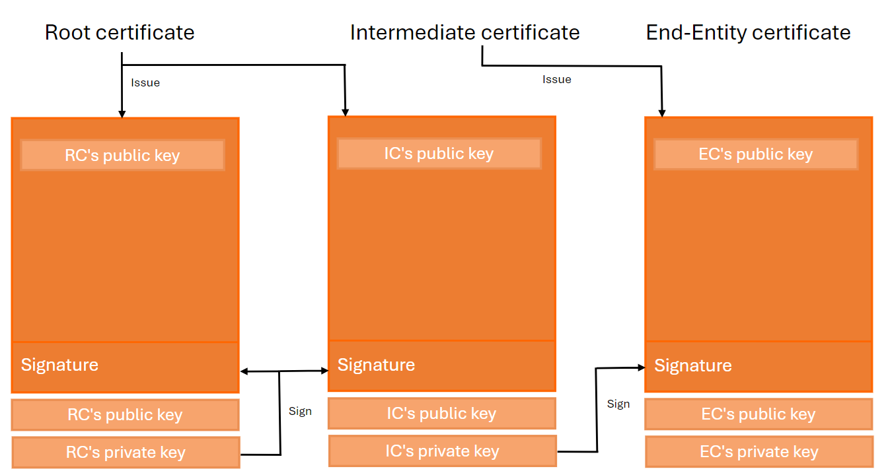

import Banner from './images/banner.jpg'
import GiscusComponent from '@site/src/components/GiscusComponent';

<div style={{textAlign: 'center'}}>
    
</div>

## Terminology

| Term | Definition |
| ---- | ---------- |
| Entity | Something that has a separate and distinct existence and can be identified in a specific context.  |
| Entity Configuration | A statement issued by an entity about itself. It contains the entity's signing keys and additional data used to control the Trust Chain resolution process, such as authority hints. |
| Identity Provider | An Identity Provider (abbreviated IdP or IDP) is a system entity that creates, maintains, and manages identity information for principals, and also provides authentication services to relying applications within a federation or distributed network. |
| Entity Statement | A signed JWT containing the information needed for an entity to participate in federations, including metadata about itself and policies that apply to other entities for which it is authoritative. |
| Relying Party | A term used to refer to a server that provides access to a secure software application. |
| Trust Anchor | An entity that represents a trusted third party. |
| Trust Chain | A sequence of entity statements representing a chain starting with an Entity Configuration (typically of a Leaf Entity) and ending with a Trust Anchor.. |

## Introduction

The [OpenID Federation](https://openid.net/specs/openid-federation-1_0.html) specification was officially published by the OpenID Connect Working Group on May 31, 2024.

The objective of this new specification is to establish a trust relationship between Identity Providers and Relying Parties. 
As a result, manual provisioning of Relying Parties via a web portal or a dedicated REST API will no longer be necessary.

There are several advantages to using OpenID Federation:

* Reduced human administration.                                                   
* Relying Parties can manage their properties, such as the `redirect_uri`.
* Easily establish trust between Identity Providers and Relying Parties.

This specification is based on concepts from Public Key Infrastructure (PKI), but there are key differences between the two:

* In Public Key Infrastructure, `Certificates` are used, and the Certificate Authority is installed in the `Trusted Root Certificate Authorities certificate store`. This store contains the root certificates of all CAs trusted by Windows.

* OpenID Federation uses `Entity Statements`, represented as JSON Web Tokens (JWT). ach entity involved in the trust chain provides a `REST API` that exposes operations, as described in [section 8 of the specification](https://openid.net/specs/openid-federation-1_0.html#section-8). Examples include `/federation_fetch_endpoint` and `resolve`.

Before proceeding, it is important to understand all the concepts related to Public Key Infrastructure.

## Chain of trust in Public Key Infrastructure (PKI)

The purpose of a Public Key Infrastructure (PKI) is to enable the secure electronic transfer of information for various network activities, such as e-commerce, internet banking, and confidential email.

PKI uses cryptographic public keys linked to a digital certificate, which authenticates the device or user sending the digital communication. Digital certificates are issued by a trusted source, known as a Certificate Authority (CA), and act like digital passports to verify the identity of the sender.

When a client, such as a browser visiting a secure website, receives a digital certificate, it validates whether the issuer of the certificate is in its list of trusted root certificates. If no match is found, the client attempts to resolve the chain of trust by locating the trusted root CA that signed the issuing CA's certificate.

The chain of trust is a crucial concept, as it proves that the certificate originates from a trusted source. Using a certificate store is sufficient to resolve this chain of trust.

A valid chain of trust consists of three main entities:

* **Root CA certificate** : A self-signed X.509 certificate that acts as a trust anchor. It is used by all relying parties as the starting point for path validation. The Root CA's private key is used to sign Intermediate CA certificates.

* **Intermediate CA certificate** : This certificate is positioned between the Root CA and the End-Entity certificate. It is responsible for signing the End-Entity certificates.

* **End-Entity certificate** : This is the server certificate issued to a website domain.



This chain of trust is also a key concept in the OpenID Federation specification.

## Chain of trust in OPENID federation

The chain of trust in the OpenID Federation consists of more than two Entity Statements.

An Entity Statement is a signed JSON Web Token (JWT). The subject (`sub`) of the JWT is the entity itself, while the issuer (`iss`) is the party that issued the Entity Statement. All entities in a federation publish an Entity Statement about themselves, called an Entity Configuration.

Entities that form the trust chain are categorized as follows:

* **Trust anchor** : An entity that represents a trusted third party.

* **Leaf** : In an OpenID Connect identity federation, this refers to a relying party or a protected resource.

* **Intermediate** : An entity that is neither a leaf nor a trust anchor.


### Algorithm to resolve the chain of trust

The resolution of the trust chain in OpenID Federation is more complex than in Public Key Infrastructure (PKI).

Assume the following architecture is deployed, with trust relationships configured between the following entities:

* Identity Provider and Trust Anchor.

* Relying Party and the Trust Anchor.


Even if the Relying Party is not registered or configured with the Identity Provider, the Identity Provider can still accept the [OPENID Authorization Request](https://openid.net/specs/openid-connect-core-1_0.html#AuthRequest) from the Relying Party, due to the trust relationship between the two entities.

Suppose the following entities are configured and deployed:

| Entity                   | Url                    |
| ------------------------ | ---------------------- |
| Relying Party            | http://localhost:7001  |
| Identity Provider        | http://localhost:5001  |
| Trust anchor             | http://localhost:7000  |

The algorithm used by the Identity Provider to resolve the trust chain consists of the following steps:

1. The Identity Provider receives a [request object](https://www.rfc-editor.org/rfc/rfc9101.html#name-request-object-2) from the Relying Party.

:::note

A Request Object (Section 2.1) is used to provide authorization request parameters for an OAuth 2.0 authorization request. 
It MUST contain all the parameters (including extension parameters) used to process the OAuth 2.0 authorization request except the request and request_uri parameters that are defined in this document. 
The parameters are represented as the JWT Claims of the object

:::

2. Parse the request object and extract the issuer (`iss`) (http://localhost:7001). 

3. Retrieve the Entity Configuration from the endpoint `http://localhost:7001/.well-known/openid-federation`.

4. Store the JSON Web Token (JWT) into the trust chain.

5. Parse the JWT and retrieve the list of `authority_hints` from the payload.

6. For each record in the `authority_hints`, perform the following actions:

   6.1. Retrieve the Entity Configuration from the `authority_hint` (`http://localhost:7000/.well-known/openid-federation`).

   6.2. Parse the JWT and extract the `federation_fetch_endpoint`.

   6.3. Fetch the Entity Statement of the Relying Party `http://localhost:7001` from the Trust Anchor (`http://localhost:7000/federation_fetch?sub=http://localhost:7001`) and store the result in the trust chain.
   
7. The final Entity Configuration retrieved from `http://localhost:7000/.well-known/openid-federation` is the Trust Anchor and must be stored in the trust chain.

8. The Identity Provider checks if the Trust Anchor is trusted and continues processing the request object. The Relying Party will automatically be registered with the Identity Provider.

In the end, the trust chain will contain three records and have the following structure:


The Relying Party will automatically be registered with the Identity Provider. 
This process is known in OpenID Federation as the [Automatic Registration workflow](https://openid.net/specs/openid-federation-1_0.html#name-automatic-registration).

There is another method for Client Registration, which can be found in the chapter on [Client Registration]("#relying-party-registration").

If the Relying Party is already known to the Identity Provider and the workflow is executed a second time, the Identity Provider will check if the trust chain is still valid.
If necessary, the Relying Party's settings will be updated with properties extracted from the  `openid_relying_party` Entity Type.

#### Federation Policy

Trust Anchors and Intermediate Entities can define policies that apply to the metadata of their subordinates.

Federations may utilize metadata policies to achieve specific objectives:

* **Ensure interoperability between entities** : Ensure that the metadata published by OpenID Providers and Relying Parties is interoperable.

* **Enforce a security profile**: Ensure that the entity metadata complies with a security profile, such as FAPI.

The logic to validate the Federation Policy must be applied after the trust chain has been obtained and validated.

The algorithm to check the Federation Policy consists of the following steps:

1. Ensure the trust chain is valid.

2. Retrieve all Entity Statements from the trust chain and order them from the highest node in the hierarchy (Trust Anchor) to the lowest node (Leaf Entity).

3. or each ordered Entity Statement, fetch the `metadata_policy` parameter.

   3.1 Retrieve the metadata policy of the previous Entity Statement.

   3.2 Merge the current metadata policy with that of the previous Entity Statement.

   3.3 If the merge is not allowed, produce a policy error.

4. Validate the entity's metadata against the merged metadata policy.

Here is an example of a policy that requires the Relying Party to provide a `client_name` metadata parameter:

**Policy**

```
{
    "metadata_policy": {
        "client_name": {
            "essential": true
        }
    }
}
```

## Difference between PKI and OPENID federation

The structure of the trust chain in both technologies is similar and consists of comparable components. 
However, the key difference lies in the terminology and the nature of the entities involved. 
In PKI, an entity is represented by a certificate, while in OpenID Federation, an entity is represented by an Entity Statement.

**X.509 Certificate VS Openid Federation**

|   | X.509 Certificate | OpenID Federation |
| - | --- | ----------------- |
| Born | 1988 | 2016 |
| Format | ASN.1 / DER | JWT |
| REST.API | - | Yes |
| Revocations | CRL, OCSP | REST.API |
| Attestation artifact | Public Key Certificate | Entity Statement |
| Chain name | Certificate chain | Trust chain |

**Entity names**

| PKI                         | Openid federation |
| --------------------------- | ----------------- |
| Root CA certificate         | Trust anchor      |
| Intermediate CA certificate | Intermediate      |
| End-entity certificate      | Leaf              |

The trust chain algorithm in OpenID Federation is more complex than in PKI. In OpenID Federation, a series of HTTP requests are executed to retrieve a list of Entity Statements, 
whereas in PKI, the certificate store alone is used.

## Relying Party registration

As discussed in the previous chapter [Algorithm to resolve the chain of trust](#algorithm-to-resolve-the-chain-of-trust), the OpenID Federation introduces two methods for registering a Relying Party with an Identity Provider: `Automatic Registration` or `Explicit Registration`.

### Automatic registration

Automatic registration allows a Relying Party to make authentication requests without a prior registration step with the Identity Provider. 
Once the authorization request is received by the Identity Provider, it uses the client identifier to resolve the chain of trust and check its validity.

For more information about this type of registration, refer to the [documentation](https://openid.net/specs/openid-federation-1_0.html#section-12.1).
If the chain of trust is valid and the federation policy is satisfied, the client will be automatically registered.

### Explicit registration

In explicit registration, the Relying Party establishes its client registration with the Identity Provider through a dedicated registration request, similar to the [Openid Connect Dynamic Client Registration](https://openid.net/specs/openid-connect-registration-1_0.html). 
Instead of submitting its metadata, the Relying Party provides its Entity Configuration or an entire trust chain.

Once explicit registration is complete, the Relying Party can make regular OpenID authentication requests to the Identity Provider.

The expiration time of the client corresponds to the earliest expiration time in the trust chain. 
When the client expires, the Identity Provider attempts to refresh the trust chain and update the client's metadata accordingly.

## Real-World Use Case

The OpenID Federation standard is used in several real-world scenarios.

### OpenID for Verifiable Credential Issuance

The OpenID Federation is implemented by the [OPENID for Verifiable Credential issuance](https://openid.net/specs/openid-4-verifiable-credential-issuance-1_0.html) standard.

The API responsible for issuing Verifiable Credentials, such as university diplomas or driver's licenses, uses OpenID Federation to verify whether electronic wallets can be trusted and are authorized to receive the Verifiable Credentials.

The Chain of Trust is passed in the `trust_chain` parameter. If the chain is valid, the Verifiable Credential is issued and stored in the electronic wallet.

### SPID - Public Digital Identity System

The OpenID Federation standard is also used in [Italy](https://docs.italia.it/italia/spid/spid-cie-oidc-docs/it/versione-corrente/la_federazione_delle_identita.html) within the SPID system (Public Digital Identity System).
It allows Italian citizens to select a Digital Identity Provider of their choice to authenticate on any public administration website.

The OpenID Federation provides a trust infrastructure that is:

* **Dynamic** : Trust can be established dynamically during the first authentication request.
* **Scalable** : It significantly reduces onboarding costs by following the principle of delegation.
* **Transparent** : Any entity involved in the federation can build trust autonomously and securely at any time.


As shown in the diagram above, two trust anchors are configured:

* **AgID** : A trusted party which within the SPID Federation.

* **MinInterno** : A trusted party within the Ministry of the Interior.

Any Relying Party with at least one trust relationship with an intermediate entity can fetch all OpenID Provider leaf entities from the Federation Listing endpoint of the trust anchor, extract their metadata, and display the list of Identity Providers.

The image below shows the authentication window displayed on a public administration website, where nine Identity Providers are configured:


In the next chapter, we will explain how to implement OpenID Federation with .NET Core.

## Demo

If you want to run a demo of OpenID Federation on your local machine, I recommend following this [guide](https://simpleidserver.com/docs/tutorial/openidfederation#demo) from SimpleIdServer. You'll create a trust chain between a Relying Party and an Identity Server.

## Conclusion

The OpenID Federation standard is highly beneficial for organizations with complex infrastructures, multiple Identity Providers, and numerous Relying Parties. 
It significantly reduces the time and effort required to manage the configuration of Identity Providers and Relying Parties.

Key advantages include:

* **Reduced human administration**: No need to use an administration website to create a client in an Identity Provider.
* **Self-management by Relying Parties**: Relying Parties can manage properties such as `redirect_uri`.
* **Easier trust relationship establishment**: Trust between the Identity Provider and the Relying Party can be set up seamlessly.

Overall, developers spend less time configuring authentication in the Relying Party.

## Resources

* https://simpleidserver.com/docs/tutorial/openidfederation#demo, Openid federation

* https://openid.net/specs/openid-federation-1_0.html, OPENID federation 1.0 - draft 36

<GiscusComponent />