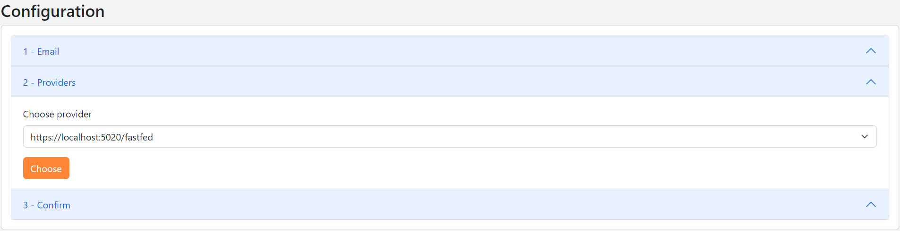
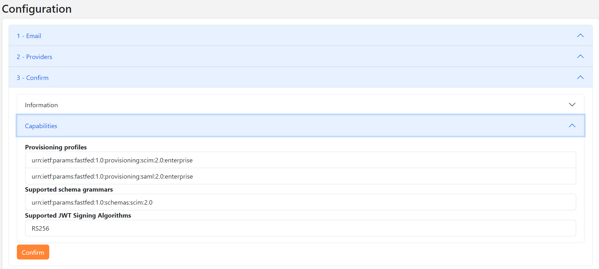
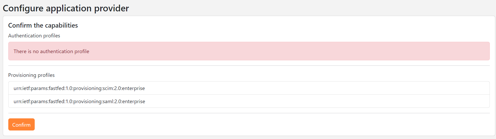
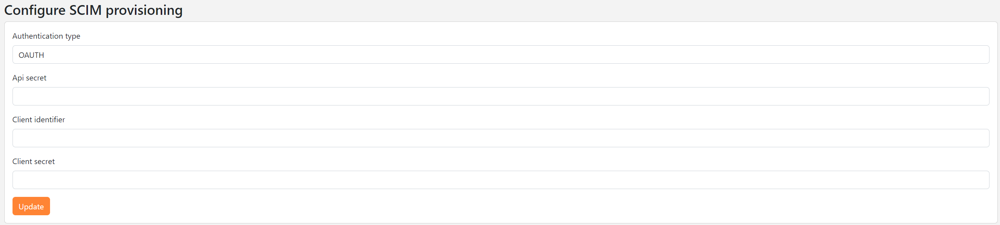

import Banner from './images/banner.png'
import GiscusComponent from '@site/src/components/GiscusComponent';

<div style={{textAlign: 'center'}}>
    
</div>

## Terminology

| Term | Definition |
| ---- | ---------- |
| Administrator | A human end-user responsible for establishing the federation between an Identity Provider and an Application Provider. Administrators are typically members of an organization with privileges to enable sign-on to Application Providers for other members of their organization. |
| Application Provider | An online service or website that requires end-user provisioning and/or authentication from an Identity Provider. |
| Capability | A feature supported by the Identity Provider or Application Provider, such as SAML or SCIM profile. |
| Identity Provider (Idp) |  A system entity that creates, maintains, and manages identity information for principals, while also providing authentication services to relying applications within a federation or distributed network. |

## Introduction

The purpose of the OpenID FastFed standard is to simplify the administrative effort required to configure Identity Federation between a Company and an Application Provider.

Let's consider an example:

Imagine a user working for an employer called "company.com." The user discovers a tool at "onlineservice.com" that helps them be more productive. To use the tool, the user wants to create a local account using their email address, "user@company.com."

It is possible to use this work email address for authentication if a federation is configured between the company's Identity Provider and the Application Provider. However, configuring this federation can be time-consuming and complex, involving manual steps such as:

* Creating and configuring the Relying Party in the company's Identity Provider.
* Updating and configuring the "onlineservice.com" website to use the newly created Relying Party.
* And more...

Even if the administrators of both companies properly configure the federation between the "onlineservice.com" application and the company's Identity Provider, the lack of a direct communication channel between both parties requires human administrators to remember to periodically refresh the configuration and rotate certificates.

In some implementations, planned refresh activities, such as certificate rotation, can temporarily disrupt the ability for federated users to sign in to the Application Provider.

An ecosystem of FastFed-enabled providers allows administrators to establish new federation relationships with just a few clicks in a web-based workflow, without needing to understand the underlying technologies.

Once the federation is set up:

* The application can authenticate employees using Single Sign-On (SSO) via the company's Identity Provider.
* Additionally, the application can receive user information from the company using provisioning protocols like SCIM.

## Establish Federation

The workflow to configure Identity Federation between the company and the Application Provider consists of the following steps:

1. The administrator of the Application Provider visits the website (https://application.com) and enters the employee's email address (user@company.com).


2. The Application Provider uses the email address to retrieve the WebFinger of the company (https://company.com/.well-known/webfinger) and displays the list of OpenID FastFed endpoints.

**Webfinger result**

```
{
    "subject":"jane@localhost:5020",
    "links":[
        {"rel":"https://openid.net/specs/fastfed/1.0/provider","href":"https://localhost:5020/fastfed"}
    ]
}
```



3. The administrator selects the FastFed endpoint and submits their choice.

4. The Application Provider fetches the capabilities of the selected endpoint (https://company.com/fastfed/provider-metadata) and displays them.

:::note

A capability is a feature supported by the company and belongs to one of the following categories:

* Authentication.
* Identity provisioning.

:::



5. The administrator reviews the capabilities and confirms their choice.

6. The administrator is redirected to the registration endpoint of the company. If the end user lacks the permission to confirm the registration on the company website, the task will be assigned to another user with administrative rights.

7. The company website fetches the capabilities of the Application Provider (https://application.com/fastfed/provider-metadata) and displays them.



8. The administrator clicks "Confirm" to complete the registration.

9. The company website sends the registration result to the Application Provider.

10. Finally, the Application Provider performs the necessary actions to enable the capabilities approved by the administrator.

The workflow may vary depending on your use case. In the previous example, we assumed the end user has permission to perform all the actions described.

In the next section, we will explain how the various capabilities are enabled by the Application Provider.

## Enable SCIM profile

According to the [FastFed Enterprise SCIM Profile 1.0](https://openid.net/specs/fastfed-scim-1_0-03.html) standard, if the provisioning profile `urn:ietf:params:fastfed:1.0:provisioning:scim:2.0:enterprise` is enabled, the Identity Provider must:

* Implement the required functionality of a SCIM client.

* Authenticate to the SCIM endpoint using the method negotiated during the FastFed registration exchange, e.g., `urn:ietf:params:fastfed:1.0:provider_authentication:oauth:2.0:jwt_profile`.

The Application Provider must : 

* Implement the required functionality of a SCIM Service Provider.

* Authenticate the client using the method negotiated during the FastFed registration exchange.

Once the capability is enabled in step 10 of the workflow, the Application Provider will create and configure a Relying Party in the Identity Provider used by the SCIM 2.0 server.
If the authentication method negotiated during the FastFed registration exchange is `urn:ietf:params:fastfed:1.0:provider_authentication:oauth:2.0:jwt_profile`, an OAuth 2.0 client must be configured.

After configuring the Relying Party, its configuration must be transferred to the company, and the SCIM client configuration must be updated.



Once the SCIM profile is configured, the company can provision employee information by using the SCIM 2.0 API of the Application Provider.

## Enable SAML Profile

According to the [FastFed Enterpise SAML Profile 1.0](https://openid.net/specs/fastfed-saml-1_0-03.html) standard, if the authentication profile `urn:ietf:params:fastfed:1.0:authentication:saml:2.0:enterprise` is enabled, the Identity Provider must:

* Implement the required functionality of a SAML Identity Provider as defined in the SAML Web Browser SSO Profile.
* Use the HTTP POST binding for the authentication response of the Web Browser SSO Profile.

The Application Provider must:

* Implement the required functionality of a SAML Service Provider in the SAML Web Browser SSO Profile.
* Use the HTTP Redirect binding for the authentication request of the Web Browser SSO Profile.

Once the capability is enabled in step 10 of the workflow, the company website will create and configure the SAML Relying Party.
The FastFed registration response returned by the Application Provider, such as the `saml_metadata_uri` parameter, will be used during the registration of the SAML Relying Party.

Once the SAML profile is configured, the Application Provider will be able to use the company's Identity Provider to authenticate end-users. 

## Demo

To run a demo of OpenID FastFed on your local machine, I recommend following this [guide](https://simpleidserver.com/docs/next/tutorial/fastfed) from SimpleIdServer.
You'll implement an infrastructure to enable SCIM provisioning via OpenID FastFed.

## Conclusion

The OpenID FastFed specification offers a workflow to reduce the time spent by administrators in configuring and maintaining federation between an Application Provider and an Identity Provider.

However, the specification has some drawbacks:

* It is not yet adopted by major Identity Providers like Auth0, Keycloak, Duende IdentityServer etc.
* It does not support OpenID as an authentication profile.

It is possible to support additional Identity Providers by developing an extension within the [SimpleIdServer FastFed open-source project](https://github.com/simpleidserver/SimpleIdServer/tree/master/src/FastFed), or you can submit a change request ticket on their GitHub.

## Resources

* https://openid.net/specs/fastfed-core-1_0-03.html, FastFed Core 1.0

* https://openid.net/specs/fastfed-saml-1_0-03.html, FastFed Enterprise SAML Profile 1.0

* https://openid.net/specs/fastfed-scim-1_0-03.html, FastFed Enterprise SCIM Profile 1.0

<GiscusComponent />